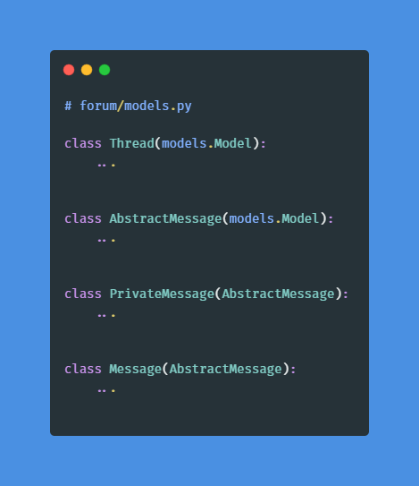
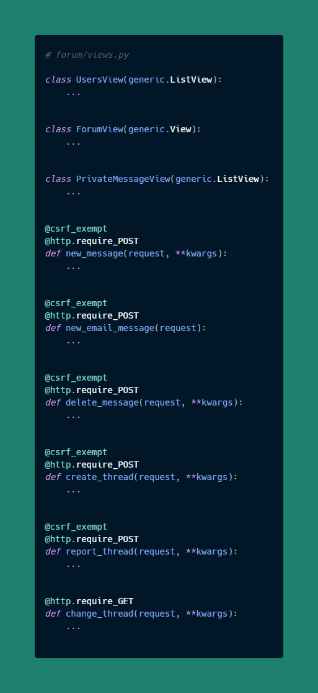
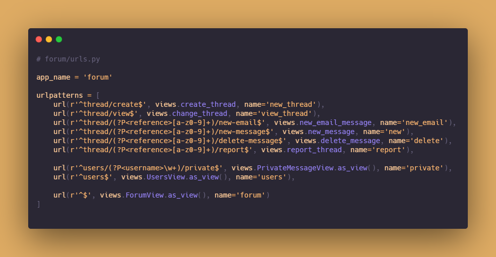

# Simple Django Messaging Template

This is a simple Django messaging template that you can use to quickly prototype a project. Feel free to download and modify for you own needs.

__NOTE:__ This project uses VueJS for the front end. You will need to have knownledge in Vue if you want to keep using it.

In case you need to deploy the application in a Docker environment, the template is shipped with all the required DockerFile and docker-compose files for just that.

## Additional words

The application is built a little bit like Intercom as opposed to a classic Chat application. In other words:

* You can interact with a user via the live chat
* Send email messages via the chat message like it were live messaging
* Create threads with a new user
* View or report a thread

These are the basic functionnalities.

__NOTE:__ On the emailing functionnaly, if the user replies to you and the message is marked as email, then your reply message will automatically be an email.

# Organization

The Pipfile comes with the following applications:

* Redis
* Django
* Celery
* Celery Beat
* Channels
* Channels redis
* Daphne
* Django extensions

## Models

## Views

## URLS

# Starting

Once you've cloned the repository or downloaded the zip file, start your project normally with `./manager.py/runserver` after having run `./manage.py migrate`.

## Redis

You will need to run a redis server locally if you want to benefit from the full live chat functionnalities when developing your application. If you are on Windows, please download the Redis files from the following github account [cuiwenyuan/Redis-Windows-32bit](https://github.com/cuiwenyuan/Redis-Windows-32bit) and then click on the `redis-server.exe` to run it.

## Celery

The template also comes with celery and celery beat in order to create tasks or periodic tasks. For a local development, after running Redis, do `celery worker -A zambda -l info` to start the main process and `celery beat -A zambda -l info` for the scheduler.

## Machine learning skeleton

The template also comes with a RidgeClassifier ML models. The model classifies a message as sensitive or insensitive depending on its content.
